

# Hisaably

### Saaf hisaab, pakki dosti.

**One shared wallet for your group, with every rupee accounted for.**

  
  
  
  
  

 

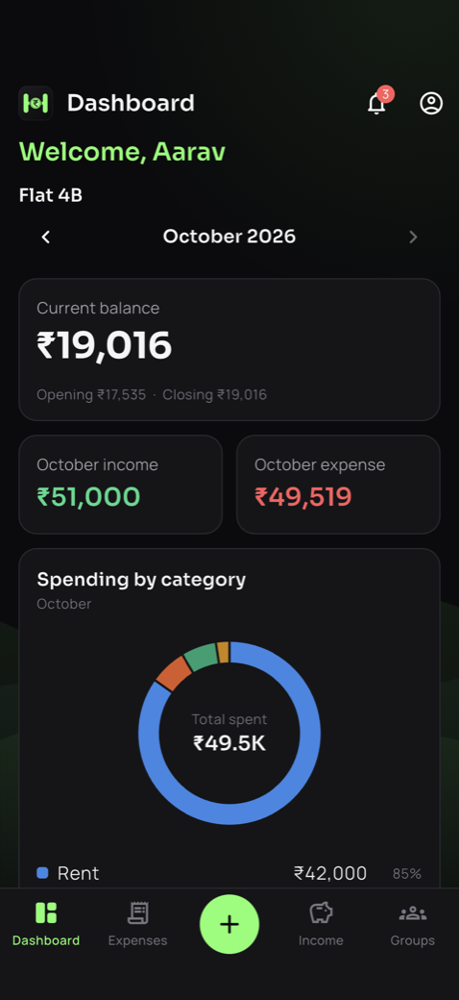
&nbsp;&nbsp;
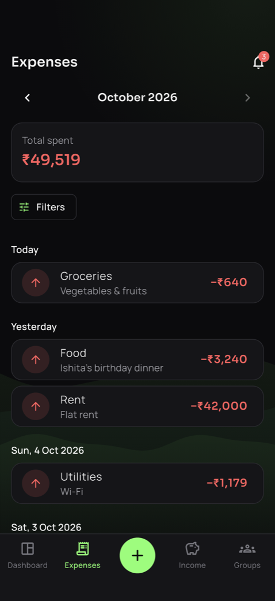
&nbsp;&nbsp;
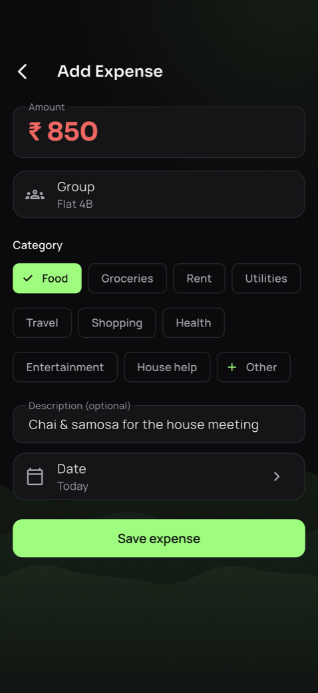

 

## Why Hisaably?

Flatmates, a family running a household, friends on a trip, a club with a kitty: any group that shares money ends up asking the same questions.

> *"Did anyone pay the electricity bill?"*
> *"How much is left in the pool?"*
> *"Who added this ₹3,000? What was it for?"*

The answers usually live in a WhatsApp thread, someone's notes app and a spreadsheet that's three weeks out of date. Nobody is sure what the balance is, and that's how small money turns into big arguments.

**Hisaably keeps one honest ledger that the whole group can see.** Money goes into the group and is spent from the group. Everyone adds what they pay or receive in a few seconds, and everyone sees the same balance, live. No more chasing, guessing or end-of-month "let me check".

 

## How it works

<table>
<tr>
<td width="33%" valign="top">

### 1 · Join your group
Your group's admin adds you. Sign in with your username, and your group's dashboard is ready. No sign-up forms, no email verification.

</td>
<td width="33%" valign="top">

### 2 · Add as you go
Tap **+**, enter the amount, pick a category, done. The date is today by default, and you can backdate a missed entry.

</td>
<td width="33%" valign="top">

### 3 · Everyone stays in sync
The others get a notification, the balance updates for everyone, and the month closes and carries forward automatically.

</td>
</tr>
</table>

 

## Features

### A dashboard that answers "where do we stand?"

<table>
<tr>
<td width="55%" valign="middle">

- **Current balance** at a glance, with the month's opening and closing.
- **This month's income and expense**, side by side.
- **Spending by category**: see where the money actually goes.
- **Income vs expense** for the last six months.
- **Balance trend**: is the pool growing or shrinking?
- **Recent entries**, one tap from the full list.
- Flip back through **past months**. Each one opens with the previous month's closing balance, with no manual carry-forward.

</td>
<td width="45%" align="center">
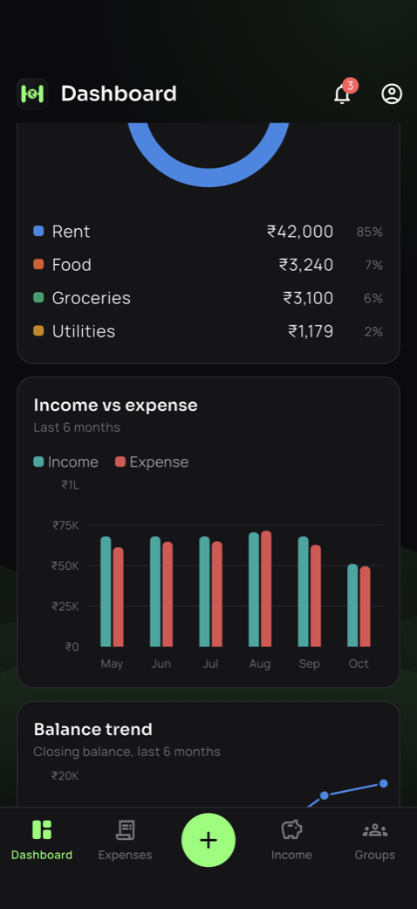
&nbsp;
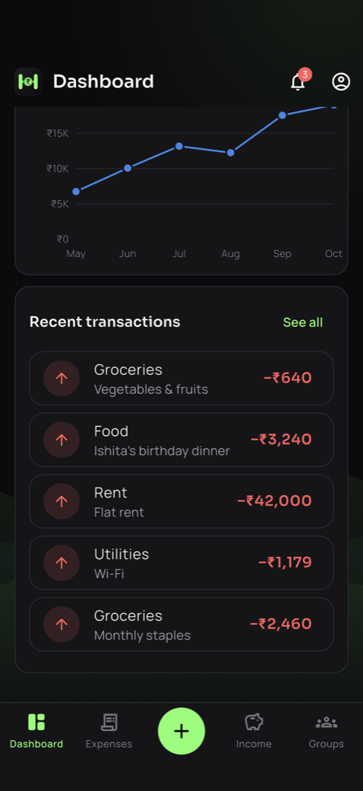
</td>
</tr>
</table>

### Adding an entry takes seconds

<table>
<tr>
<td width="45%" align="center">
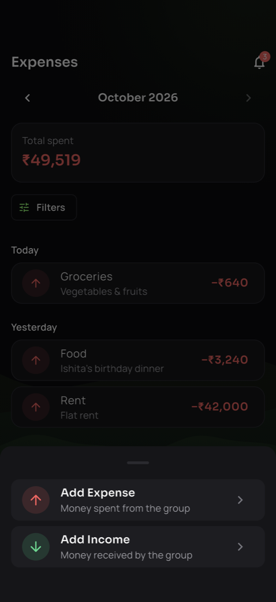
&nbsp;

</td>
<td width="55%" valign="middle">

- One **+** button, always in reach: **Add Expense** or **Add Income**.
- **Categories made for your group**: Rent, Groceries, Utilities and more. Need something new, like *House help*? Choose **Other**, type it, and it's added for your group.
- **Backdate** a forgotten entry. Future dates are blocked, so the books stay honest.
- An optional note, so the whole group knows what it was for.

</td>
</tr>
</table>

### A clear, searchable ledger

<table>
<tr>
<td width="55%" valign="middle">

- Separate **Expenses** and **Income** lists, grouped by day ("Today", "Yesterday", …).
- **Totals for the month** right on top.
- **Filters** by category, amount range or all time.
- Tap any entry for its details. Admins can **edit** or **delete** mistakes, and deleted entries are kept in the records instead of disappearing.
- Long histories load smoothly page by page, even with years of entries.

</td>
<td width="45%" align="center">

&nbsp;
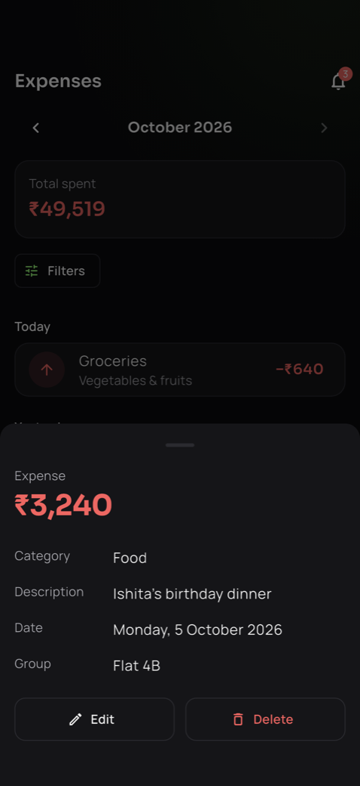
</td>
</tr>
</table>

### Everyone is in the loop

<table>
<tr>
<td width="45%" align="center">
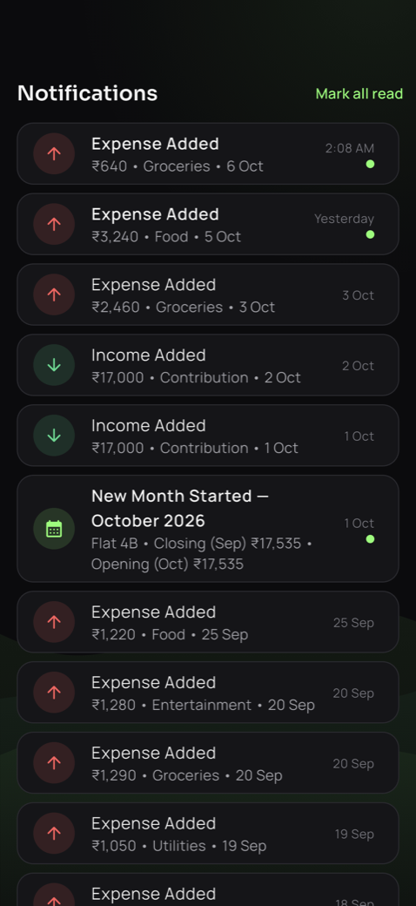
&nbsp;
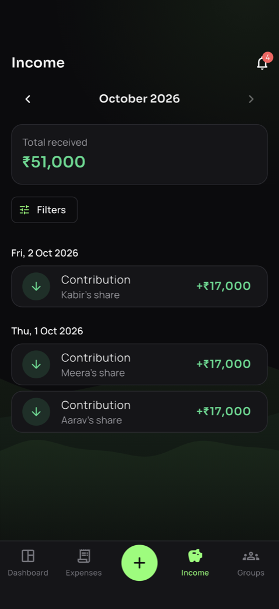
</td>
<td width="55%" valign="middle">

- When someone adds an entry, **everyone else in the group gets a notification**: *"Expense Added · ₹850 · Food · 26 Sep"*.
- On the **1st of every month**: *"New Month Started"*, with last month's closing and this month's opening balance.
- Tap a notification to jump straight to that entry.
- An unread badge on the bell, and **Mark all read** when you've caught up.

</td>
</tr>
</table>

### Works without internet

No signal in the lift, or on a trip in the hills? **Keep adding entries.** They're saved on your phone straight away and marked *Pending*. When you're back online, they sync by themselves. Entries are never duplicated, and entries added offline on two different phones both make it in.

### Groups with clear roles

<table>
<tr>
<td width="55%" valign="middle">

Each group has **up to 10 active members** and a simple role system:

| | **Member** | **Group Admin** |
|---|:---:|:---:|
| See the dashboard, ledger and charts | ✅ | ✅ |
| Add income and expenses | ✅ | ✅ |
| Get notifications | ✅ | ✅ |
| Edit or delete entries | | ✅ |
| Rename and tidy up categories | | ✅ |
| Rename the group | | ✅ |
| Enable or disable members | | ✅ |

Money belongs to **the group**, not to any one person. Entries record *what* happened, not *who typed it*, so there's no "your expense vs my expense". It's the group's hisaab.

</td>
<td width="45%" align="center">
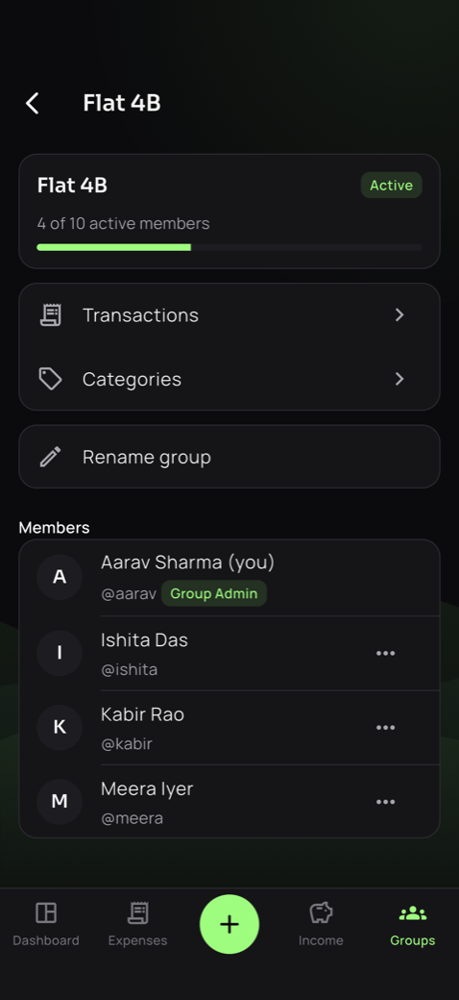
&nbsp;
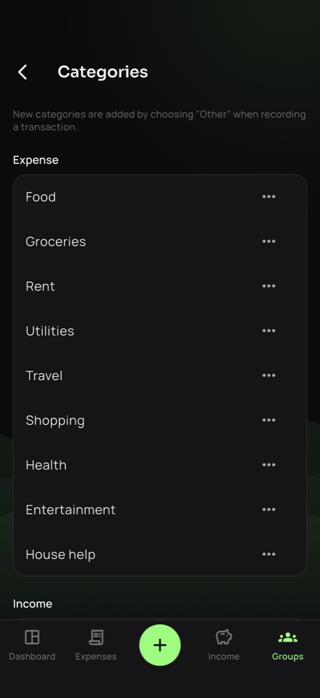
</td>
</tr>
</table>

### Private by design

- **Invite-only.** There's no public sign-up; every account is created for its owner.
- **Your group's data is visible only to your group.** The server enforces this for every request, not just the app.
- **Passwords are never visible** to anyone, not even admins. If you forget yours, an admin sets a new one.
- Every amount is stored exactly, to the paisa.

 

## A closer look

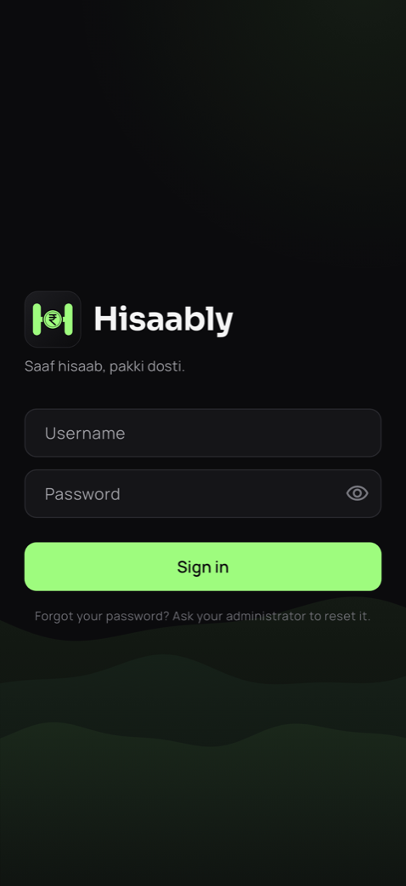
&nbsp;
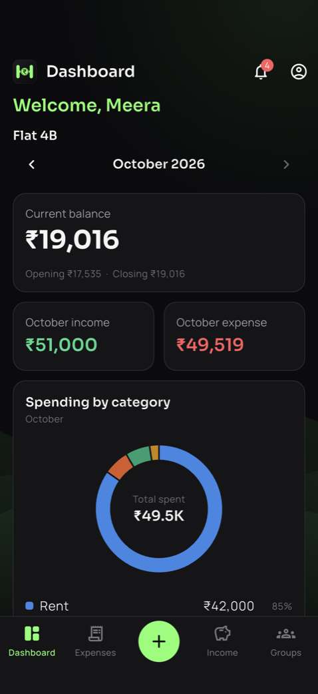
&nbsp;

&nbsp;

Screens show a sample group, "Flat 4B", with made-up people and numbers.

 

## Want to use Hisaably?

Hisaably is **invite-only**, for groups we set up personally.

<table>
<tr>
<td width="50%" valign="top">

#### 📱 Android
A ready-to-install **APK** is available on request.

</td>
<td width="50%" valign="top">

#### 🍎 iPhone
Installed for you on request.

</td>
</tr>
</table>

**To get your group set up or to get the Android APK, write to:**

### ✉️ [vcax99@gmail.com](mailto:vcax99@gmail.com?subject=Hisaably%20%E2%80%94%20access%20request)

Tell us your group's name and how many people will use it.

 

 

Made with care by <b>Bikash</b>

